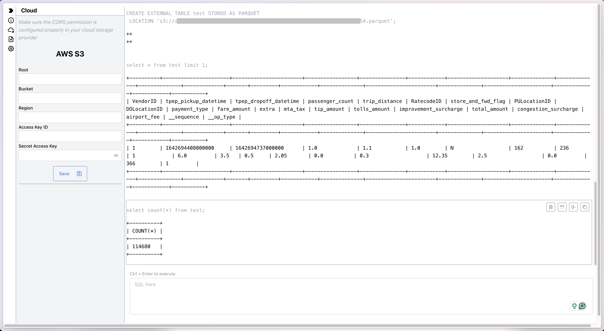

<div style="display: inline-flex; align-items: center; justify-content: center; margin: 0 auto;">
    
    
</div>

DataFusion Playground
---------------------

Playground of [Apache Arrow DataFusion](https://github.com/apache/arrow-datafusion) with [WebAssembly](https://webassembly.org). In the early experimental stage as my side project.

🌱 Live Demo: https://datafusion-contrib.github.io/datafusion-wasm-playground/

## Features

- Upload local CSV/JSON datasets (or point to remote files) and query them via SQL.
- Experimental FLASH FASTQ merge powered by the Rust/WebAssembly port of flash-lib.
- Full functional DataFusion query engine running in the browser.

## Screenshot



## Examples

Create an external table from S3 parquet file:

```sql
CREATE EXTERNAL TABLE test STORED AS PARQUET
LOCATION 's3://path-to-your.parquet';
```

Create an external table from HTTP parquet file:

```sql
CREATE EXTERNAL TABLE lineitem
STORED AS PARQUET
LOCATION 'https://shell.duckdb.org/data/tpch/0_01/parquet/lineitem.parquet';
```

Explain a query:

```sql
EXPLAIN SELECT MIN(airport_fee), MAX(airport_fee) FROM test;
```

## FLASH FASTQ Merge (Experimental)

This playground bundles the Rust implementation of FLASH compiled to WebAssembly, so you can
upload paired FASTQ files and inspect the merged results directly in the browser:

1. Build the WebAssembly artefact from the workspace root:

   ```bash
   rustup target add wasm32-unknown-unknown # once per environment
   cargo build -p flash-wasm --release --target wasm32-unknown-unknown
   mkdir -p public
   cp ../target/wasm32-unknown-unknown/release/flash_wasm.wasm public/
   ```

2. Start the playground (`pnpm dev`/`npm run dev`) and open the **Datasets** and **FLASH Merge**
   tabs.
   - In **Datasets**, upload a CSV/JSON file to register a queryable in-memory view without leaving the UI.
   - In **FLASH Merge**, select your forward (`R1`) and reverse (`R2`) FASTQ
     files, then click **Run FLASH** to view or download the merged outputs. The uploader also
     registers four DataFusion views so you can query the results directly:

   - `flash_input_pairs` with the original paired reads.
   - `flash_combined` with successfully merged reads.
   - `flash_not_combined_left` / `flash_not_combined_right` mirroring FLASH's not-combined outputs.
